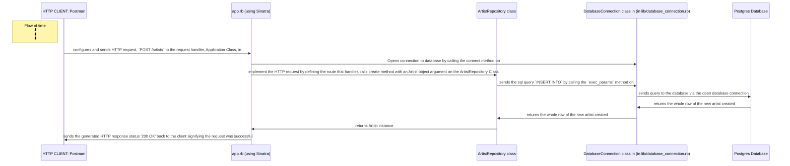
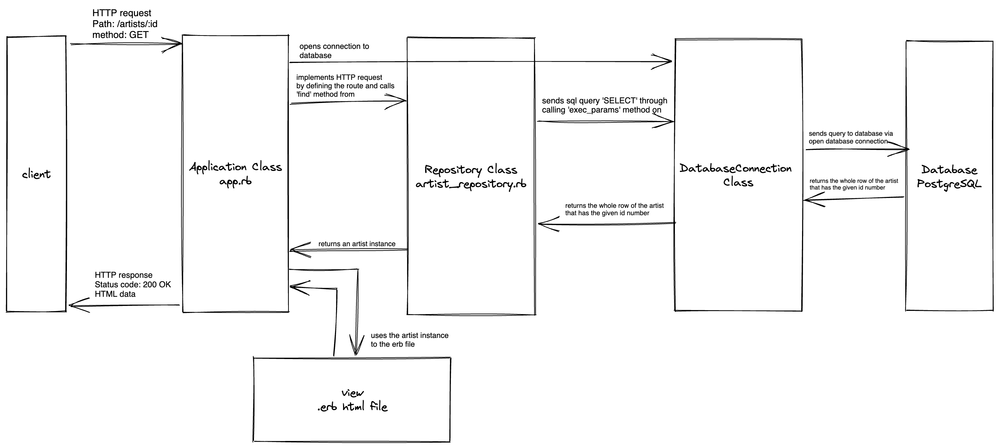

# WEB APPLICATIONS:

----

## Introduction

This project connects together what I have learnt working with databases and with what I have learnt in building web applications.

>A simplified schema of how a typical database-backed (CRUD) web application works:
> 1. The client sends a HTTP request to the web server over the Internet: GET /albums
> 2. The web server (a Sinatra application, in our case) handles the request, and executes the route block, which calls the method AlbumRepository#all
> 3. The Repository class runs a SQL query to the database.
> 4. The database returns a result set to the program.
> 5. The Repository class returns a list of Album objects to the route block.
> 6. The route block sends a response to the client containing the data.

----

## Objective

* To learn how to test-drive Sinatra routes which interacts with database-backed Repository class
* TO learn how to use Embedded Ruby(ERB) syntax to dynamically generate HTML responses
<!-- We can use ERB (for Embedded Ruby) syntax to generate dynamically the HTML that is sent to the client, by replacing the dynamic parts of the HTML, which are delimited by ERB tags (in between <%= and %> to print on the erb file, <% and %> to execute a ruby code block). -->
* To learn how to use HTML links to make the browser send `GET` requests.


----

## Sequence diagram for web application: `post/artists` route with Database:



----

## Sequence diagram explaining the behaviour of the program when a request is sent to `GET /artists/:id`:



----

## Other information

* when building programs, we use RSpec as a client to test-drive our HTTP routes
* using **hypertext links**, or **anchor links** in HTML with `<a>` HTML tag to create links with attribute `href` containing the path of the link. example below:

```html
<a href="/about">Go to the about page</a>
```

* using browser developer tools to inspect HTTP requests sent by the browser, and the responses it receives can help get visibility into what the browser sends and get back through its HTTP connection with the web server.