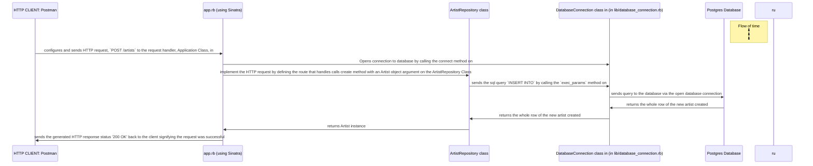

```mermaid
sequenceDiagram
    participant pm as HTTP CLIENT: Postman
    participant sin as app.rb (using Sinatra)
    participant ar as ArtistRepository class
    participant db_conn as DatabaseConnection class in (in lib/database_connection.rb)
    participant db as Postgres Database


    Note left of ru: Flow of time <br />⬇ <br /> ⬇ <br /> ⬇


    %% t->>app: Runs `ruby app.rb`
    pm->>sin: configures and sends HTTP request, `POST /artists` to the request handler, Application Class, in
    sin->>db_conn: Opens connection to database by calling the connect method on
    sin->>ar: implement the HTTP request by defining the route that handles calls create method with an Artist object argument on the ArtistRepository Class
    ar->>db_conn: sends the sql query `INSERT INTO` by calling the `exec_params` method on
    db_conn->>db: sends query to the database via the open database connection
    db->>db_conn: returns the whole row of the new artist created
    db_conn->>ar: returns the whole row of the new artist created
    ar->>sin: returns Artist instance
    sin->>pm: sends the generated HTTP response status '200 OK' back to the client signifying the request was successful
```
